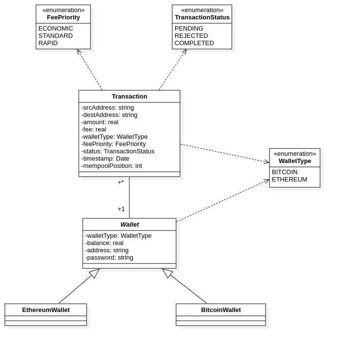
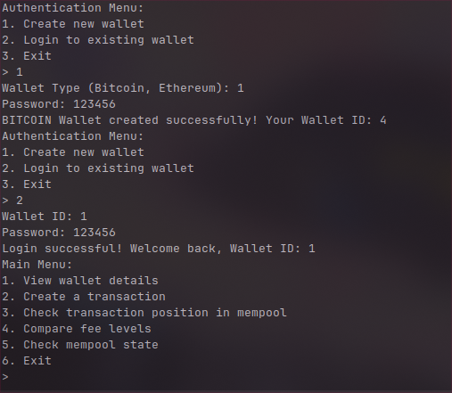
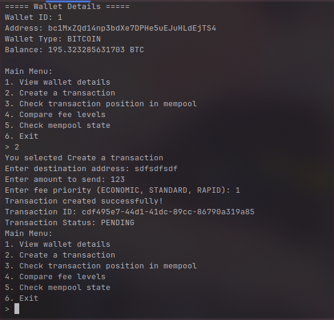
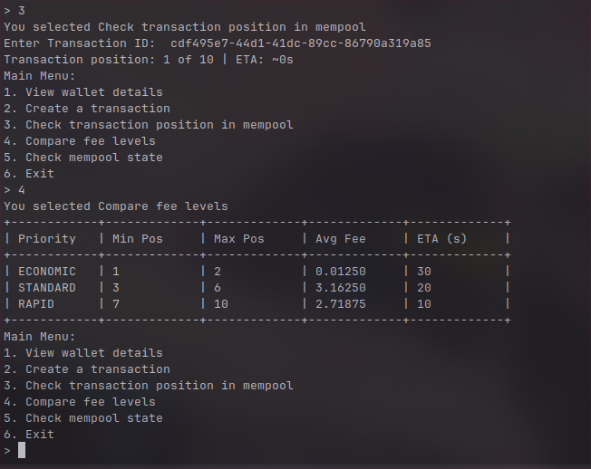
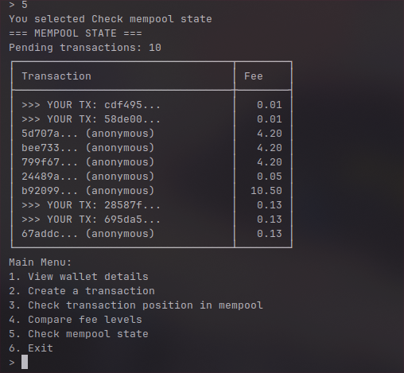

# CryptoLik

## Project Description

CryptoLik is a Java-based cryptocurrency simulation application that implements blockchain-like functionality with a mempool service for transaction management. The application features a modular architecture with dependency injection, database integration, and a user-friendly menu-driven interface.

The project simulates cryptocurrency operations including transaction processing, mempool management, and user authentication, providing a platform for understanding blockchain concepts.

## Technologies Used

- **Java** - Core programming language
- **Database Integration** - Custom database layer for data persistence
- **Dependency Injection** - Custom DI container for modular architecture
- **Multi-threading** - Asynchronous mempool processing
- **Menu-driven UI** - Interactive console-based user interface

## Project Structure

```
CryptoLik/
├── src/                          # Source code directory
│   ├── Main.java                 # Application entry point
│   ├── config/                   # Configuration files and settings
│   ├── db/                       # Database layer and initialization
│   ├── di/                       # Dependency injection system
│   ├── dto/                      # Data Transfer Objects
│   ├── entity/                   # Data models and entity classes
│   ├── exceptions/               # Custom exception classes
│   ├── mapper/                   # Object mapping utilities
│   ├── repository/               # Data access layer
│   ├── service/                  # Business logic services
│   ├── ui/                       # User interface components
│   └── util/                     # Utility classes and helpers
└── README.md                     # Project documentation
```

## Prerequisites and Installation

### Prerequisites

- Java Development Kit (JDK) 8 or higher
- PostgreSQL database server
- IDE (IntelliJ IDEA, Eclipse, or VS Code recommended)
- Git (for version control)


### Installation and Configuration

1.  **Clone the repository:**

    ```bash
    git clone git@github.com:tahajaiti/CryptoLik.git
    cd CryptoLik
    ```

2.  **Database Setup:**
   - Ensure your PostgreSQL server is running.
   - Create a new database for the application.
   - Update the database connection details in `src/config/DBConfig.java`. Modify the `DB_URL`, `DB_USER`, and `DB_PASSWORD` fields with your database credentials.

```java
    // Example from src/config/DBConfig.java
    public class DBConfig {
        public static final String DB_URL = "jdbc:postgresql://localhost:5432/your_database";
        public static final String DB_USER = "your_username";
        public static final String DB_PASSWORD = "your_password";
    }
```
   - Run the SQL scripts located in the `resources/sql/` directory against your database to set up the required tables.

3. **Compile the project:**

   ```bash
   javac -cp "lib/*:." src/**/*.java -d out
   ```

4. **Run the application:**

   ```bash
   java -cp "lib/*:out" Main
   ```

   Or if using an IDE:

   - Import the project
   - Set the main class as `Main.java`
   - Run the project

### Creating and Running the Executable JAR

- You can package the application into an executable JAR file.

1. Create the MANIFEST.MF file with the following content:

   ```
   Manifest-Version: 1.0
   Main-Class: Main
   Class-Path: lib/postgresql-42.7.8.jar

   ```

2. Compile and package the JAR:
   
- Use the jar command to package your compiled classes into CryptoLik.jar. This command must be run from the project's root directory.

   ```bash
   jar cvfm CryptoLik.jar MANIFEST.MF -C out/ . lib
   ```

- **cvfm** : creates a new JAR, uses verbose output, specifies the JAR file name, and uses the specified manifest.
- **CryptoLik.jar** : The name of the output JAR file.
- **MANIFEST.MF** : The manifest file to include.
- **-C out .** : Changes to the out directory and includes all of its contents.

3. Run the JAR file:

   ```bash
   java -jar CryptoLik.jar
   ```
   
## Usage Guide

### Starting the Application

1. Launch the application by running the `Main` class
2. The system will automatically:
   - Initialize the dependency injection container
   - Set up the database
   - Start the mempool service in a separate thread
   - Launch the authentication menu

### Main Features

#### Authentication System

- The application starts with an authentication menu
- Users can register new accounts or log into existing ones

#### Mempool Service

- Runs continuously in the background
- Processes pending transactions
- Manages transaction validation and queuing

#### Menu Navigation

- Navigate through different menus using the provided options
- Each menu provides specific cryptocurrency-related functionalities

### Basic Workflow

1. **Start Application** → Authentication required
2. **Login/Register** → Access main features
3. **Transaction Management** → Create and manage transactions
4. **Mempool Monitoring** → View pending transactions

## Screenshots

[](resources/classdiagram.png)

[](resources/captures/1.png)

[](resources/captures/2.png)

[](resources/captures/3.png)

[](resources/captures/4.png)
---
